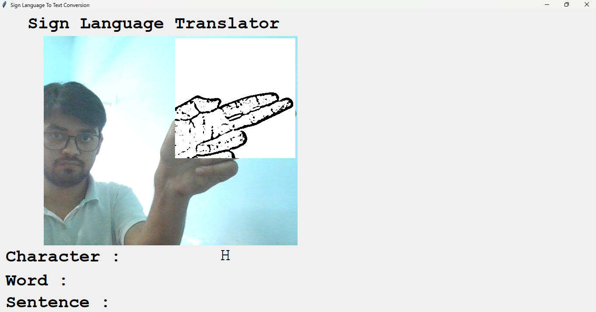
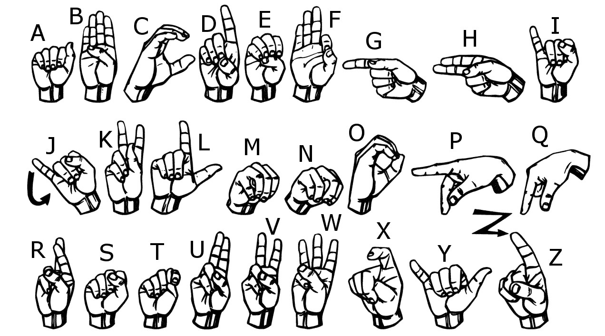

# Sign Language Translator

)

## Abstract

As we all know Sign language is one of the oldest and most natural form of language for communication, even though we don't know the meaning of particular gesture we convey our idea somtimes using common getsures like nodding.
In this method, the hand is first passed through a filter and after the filter is applied the hand is passed through a classifier which predicts the class of the hand gestures. This method provides 92.00 % accuracy for the 26 letters of the alphabet.

## Project Description

Therer are several regional based sing languages such as American sing language, British sighn Language, Indian Sign language. 
In our project American sign language is used since it a predominant sign language.The only Deaf and Mute people have communication related and they cannot use spoken languages hence the only way for them to communicate is through sign language.  

Gestures are the nonverbally exchanged messages and these gestures are understood with vision. This nonverbal communication of deaf and dumb people is called sign language. 

In this project I basically focus on producing a model which can recognize Fingerspelling based hand gestures in order to form a complete word by combining each gesture. 

I have the trained the model on English Alphabets are as given in the image below.



### Training and Testing dataset.

I captured each frame shown by the webcam of our machine. 

In each frame I defined a region of interest (ROI) which is denoted by a blue bounded square as shown in the image below.


## Libraries Requirements -(Requires the latest pip version to install all the packages)

Note : Python 3.11 or above is required to build this project, as some of the libraries required can't be installed on the lastest version of the Python  

```bash
1. Lastest pip -> pip install --upgrade pip

2. numpy -> pip install numpy

3. os-sys -> pip install os-sys

4. opencv -> pip install opencv-python

5. tensorFlow ->  pip install tensorflow 

7. keras -> pip install keras

8. tkinter -> pip install tk

9. PIL -> pip install Pillow

10. enchant -> pip install pyenchant (Python bindings for the Enchant spellchecking system)

11. autocorrect -> pip install autocorrect (Spelling correction and suggestion with enchant)
```

## Run Command for exuting the Project 

``` python
current directory/python.exe Application.py
```

  
